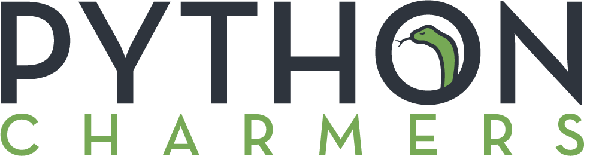

# Welcome!

We are delighted that you will be attending a Python training course run by
[Python Charmers](https://pythoncharmers.com)! These materials describe what to
expect and how to get the most out of the training course. They also include an
introductory tutorial (and links to other texts) for those new to programming.

## Credit

The introductory tutorial in these materials is adapted from
[**A Byte of Python**](https://python.swaroopch.com) by
[Swaroop C H](https://swaroopch.com), a superb free introduction to the
language that we recommend reading in full.

We have modified it substantially: chapters have been rewritten, reordered,
added and removed to suit our courses. Any errors introduced along the way are
ours, not his.

Like the original, these materials are released under a
[Creative Commons Attribution-ShareAlike 4.0 International License](http://creativecommons.org/licenses/by-sa/4.0/).

