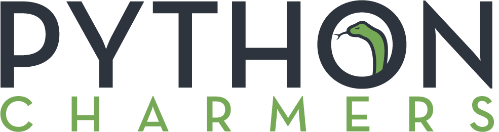

# Introduction

"A Byte of Python" is a free book on programming using the Python language. It serves as a tutorial or guide to the Python language \(version 3\) for a beginner audience. If all you know about computers is how to save text files, then this is the book for you.

This version is customized by [Python Charmers](https://pythoncharmers.com) to be optimal as pre-course reading for Python Charmers' [Introduction to Python](https://pythoncharmers.com/training/introduction-to-python/) course.

## Original edition

The original version by [Swaroop C H](https://swaroopch.com) is online [here](https://python.swaroopch.com).

## License

This book is licensed under a [Creative Commons Attribution-ShareAlike 4.0 International License](http://creativecommons.org/licenses/by-sa/4.0/). See LICENSE.md for details.

## Read online

The book is hosted online here: [https://app.gitbook.com/@pythoncharmers/s/byte-of-python/](https://app.gitbook.com/@pythoncharmers/s/byte-of-python/)

